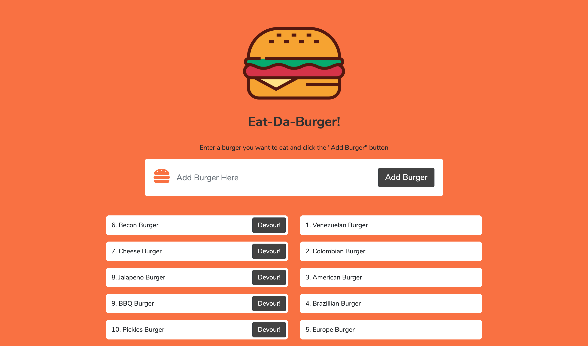

# Eat Da Burger 🍔

## Description
​
Eat Da Burger logger with MySQL, Node, Express, and Handlebars. Node and MySQL to query and route data, and Handlebars to generate HTML.
​
## Table of Contents
* [Installation](#installation) 
 
* [Usage](#usage) 
 
* [License](#license) 
 
* [Contributing](#contributing) 
 
* [Tests](#tests) 
 
* [Questions](#questions) 

## Installation
​
To install necessary dependencies, run the following command:
​
npm install
​
## Usage
​
Run "node server.js" to start the server localhost:8080
​

## Demo
​
Visit to see my work: https://manny-burger.herokuapp.com/

## License
​
This project is licensed under the MIT license.
  
## Contributing
​
[FullStackForce]('https://github.com/FullStackForce') 

## Tests
​
To run tests, run the following command:
​
npm test
​
## Questions
​

If you have any questions about the repo, open an issue or contact [FullStackForce](https://github.com/FullStackForce) directly at .